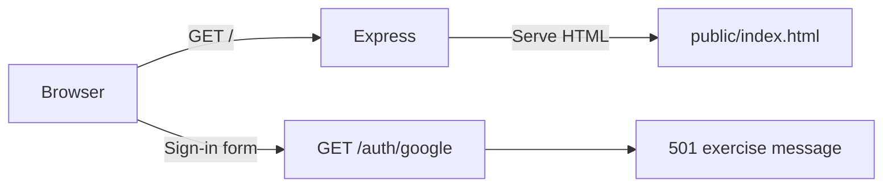
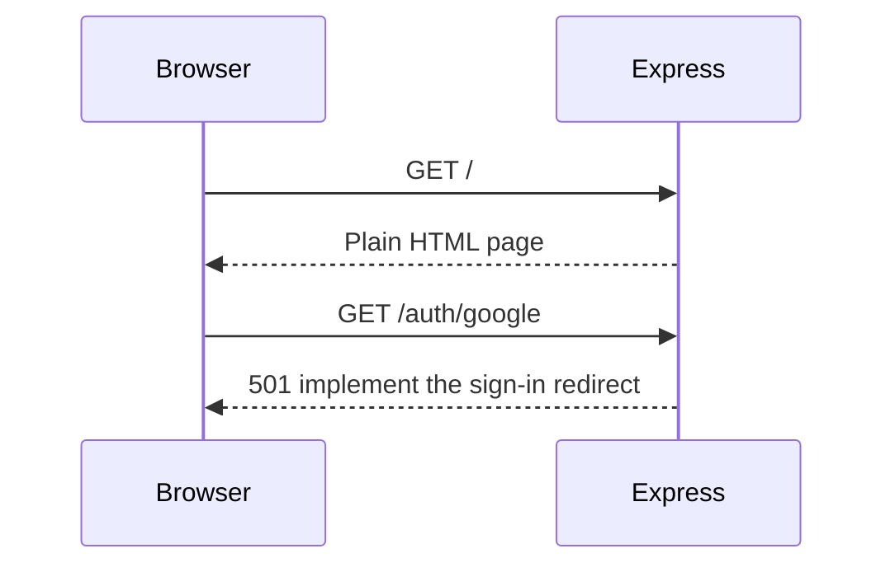

# Google sign-in practice

A deliberately small Node.js scaffold. You implement authentication yourself.
The only dependency is Express. The frontend is plain HTML with a little CSS.
There is no frontend JavaScript, bundler, database, or completed OAuth flow.

## Run

Use Node.js 24 or newer:

```sh
npm install
cp .env.example .env
npm run dev
```

Open http://localhost:3000. No Google credentials are needed to run the scaffold.
`npm run dev` restarts the server when code changes. Refresh your browser after
editing HTML. `npm start` runs without file watching.

## Read the code

- `src/server.js`: static files, form parsing, and four exercise routes.
- `public/index.html`: the complete frontend. Its form sends a normal GET request.
- `.env.example`: configuration names. Put your secrets in the ignored `.env` file.
- `README.md`: the target authentication flow, diagrams, and acceptance checks.

## Exercises

1. Create a Google OAuth client for a web application. Register exactly
   `http://localhost:3000/auth/google/callback` as the redirect URI. Fill in `.env`.
2. Add server-side sessions (for example, `express-session`) and an OIDC client
   library (for example, `openid-client`). Give `SESSION_SECRET` a random value.
3. Implement `GET /auth/google`: create state, nonce, and PKCE values, save the
   pending login in the session, and redirect to Google with `openid email profile`.
4. Implement the callback: check state, consume the pending login, exchange the
   authorization code, and let the library validate the ID token and nonce.
   Regenerate the session, save `sub`, name, and email, then redirect to `/app`.
5. Protect `/app` using the session and render the user's profile. Escape any
   profile values inserted into HTML; a template engine such as EJS can help.
6. Add a logout form with a CSRF token. Implement `POST /logout` to validate it,
   destroy the session, clear the cookie, and redirect home.
7. Work through the acceptance checks in `README.md`. Try cancelled login, invalid
   state, a reused callback, a page refresh, and access after logout.

The scaffold intentionally returns HTTP 501 for unfinished authentication routes
and HTTP 401 for `/app`. These are exercise markers, not working authentication.
Google tokens and client secrets belong on the server, never in `public/`.
The optional to-do list can wait until sign-in works.

## Current scaffold





See `README.md` for the sequence you will build toward and links to Google's docs.
