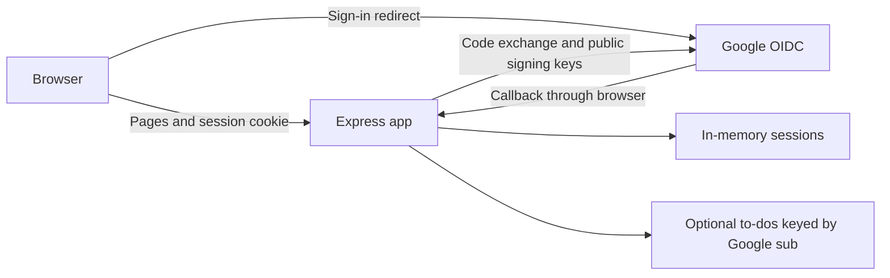
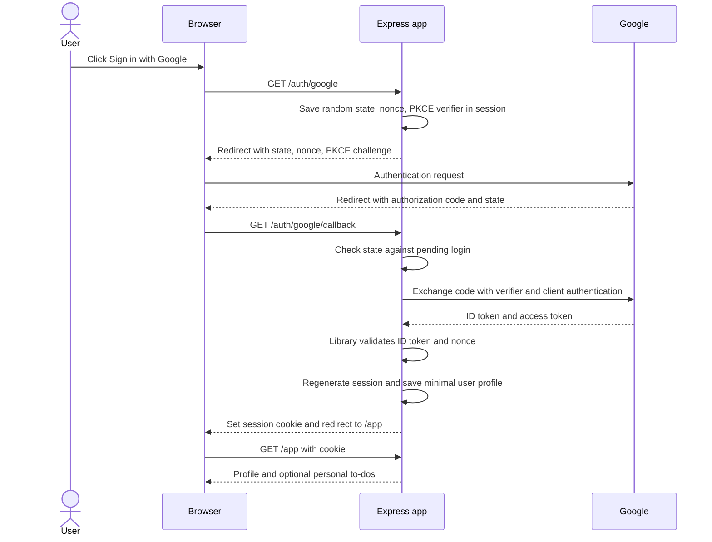

# Google SSO learning project — 1–2 hours

For scaffold setup and exercises, see [GETTING_STARTED.md](GETTING_STARTED.md).

## Goal

Build a local web app where you sign in with Google, see your profile, and sign out. If time permits, add a private to-do list to practice protecting user data.

Success means you can explain the redirect, authorization code exchange, ID token validation, and your app's session cookie. OAuth 2.0 delegates access; OpenID Connect (OIDC) adds authentication. This project uses Google's OIDC authorization code flow.

Assumptions: you know basic JavaScript, have Node.js installed, and can create an OAuth client in a Google Cloud project. Budget 60 minutes for sign-in and another 60 for the to-do list, checks, and troubleshooting. Cloud account or organization access delays can exceed that estimate.

## Approach and scope

Use Node.js, Express, an OIDC client library such as `openid-client`, `express-session`, and EJS templates. Keep one server and one browser origin at `http://localhost:3000`. Use the library for protocol handling and token verification; write the routes yourself so the flow remains visible.

A full authentication framework would hide more of the learning; hand-writing JWT verification adds work with little benefit for this exercise.

Include:
- A landing page with “Sign in with Google”.
- A protected profile page showing name and email, with Google `sub` as the stable user identifier.
- App logout and a readable sign-in error with a retry link.
- Optional: add and toggle personal to-dos, held in server memory by user `sub`.

Exclude: database, React, deployment, password login, multiple providers, Google API access, refresh tokens, roles, and visual polish. Restarting the server clears sessions and to-dos. App logout does not sign the user out of Google.

## System design

## Routes and files

| Route | Behavior |
| --- | --- |
| `GET /` | Public landing page |
| `GET /auth/google` | Start OIDC login; request only `openid email profile` |
| `GET /auth/google/callback` | Validate response, establish session, redirect to `/app` |
| `GET /app` | Require session; show profile and optional to-dos |
| `POST /logout` | Validate CSRF token, destroy session, clear cookie, redirect home |
| `POST /todos` (optional) | Require session and CSRF token; add a trimmed title of 1–200 characters |
| `POST /todos/:id/toggle` (optional) | Require session and CSRF token; toggle only a to-do owned by current user |

Keep files small: `src/server.js` for app/session setup, `src/auth.js` for OIDC routes and auth guard, `src/todos.js` for optional data/routes, `views/` for escaped templates, `.env.example` for configuration, and `GETTING_STARTED.md` for setup and flow notes. Ignore `.env` in Git.

## Essential behavior

- Register a Google OAuth client of type **Web application**. Configure branding/audience and test users if required by the project's testing settings. Register the exact redirect URI `http://localhost:3000/auth/google/callback`.
- Environment variables: `GOOGLE_CLIENT_ID`, `GOOGLE_CLIENT_SECRET`, `SESSION_SECRET`, and `BASE_URL=http://localhost:3000`.
- Use Google's discovery document: `https://accounts.google.com/.well-known/openid-configuration`.
- Use state, nonce, and PKCE S256. Reject absent/mismatched state and missing pending login data; consume temporary login data once.
- Delegate ID token signature, issuer, audience, expiration, and nonce validation to the OIDC library. Never treat a merely decoded token as verified.
- Regenerate the session after login. Store only `sub`, name, and email; no Google tokens in the browser or logs. Discard returned tokens after validation because no Google APIs are called.
- Session cookie: `HttpOnly`, `SameSite=Lax`, and a one-hour lifetime. `Secure=false` only for this localhost HTTP exercise; HTTPS requires `Secure=true`.
- Protect app mutations with a session CSRF token. Use escaped template output. Resolve to-do ownership from the authenticated session, never a posted user ID.
- On cancelled login or failed validation, create no authenticated session; show a generic retry message. Log only a sanitized error category.

## Build plan

| Time | Deliverable | Check |
| --- | --- | --- |
| 0–15 min | Google OAuth client, environment variables, Express skeleton and landing page | App starts; registered callback matches exactly |
| 15–40 min | OIDC start/callback routes using library discovery and verification | Real Google login reaches a protected profile page |
| 40–50 min | Session guard, logout, CSRF protection, error page | Anonymous access redirects; logout removes access |
| 50–60 min | Verify core flow and write brief README notes | Explain code vs ID token vs access token vs cookie |
| 60–85 min | Optional in-memory to-do form/list and toggle route | Add and toggle work for the current user |
| 85–105 min | Focused authentication and ownership checks | All checks below pass for included features |
| 105–120 min | Troubleshooting buffer and learning notes | Repeat complete flow from a fresh browser session |

At 60 minutes, a working sign-in/profile/logout app is a complete first milestone. If authentication takes longer, drop the to-do list and spend the remaining budget verifying the core flow.

## Acceptance checks

- Signed-out requests to `/app` redirect to login; protected POST routes cannot mutate data without authentication.
- Real Google sign-in displays the expected profile and survives a page refresh.
- A callback with a tampered or missing state fails without creating a session; a reused callback cannot log in again.
- Cancelled sign-in returns a readable retry path; no Google credentials or tokens appear in logs or rendered HTML.
- Logout ends app access; POST requests without a valid CSRF token fail.
- If to-dos are included, two separate browser sessions signed into different Google accounts cannot view or toggle one another's items. Unknown or foreign IDs return 404.

Use manual browser checks for the real Google flow. Add small automated route tests for anonymous access, invalid callback state, CSRF rejection, and cross-user to-do mutation if that feature is included; do not automate Google's login UI.

## Learning prompts

1. Why does the callback contain a code rather than your application's session?
2. What is each of the ID token, access token, and session cookie used for?
3. What do state, nonce, and PKCE each bind or protect?
4. Why use Google's `sub` rather than email to identify a user?
5. Why can Google sign you back in after you log out of this app?

## References

- [Google OpenID Connect](https://developers.google.com/identity/openid-connect/openid-connect): authentication, discovery, ID tokens, and identity claims.
- [Google OAuth 2.0 for web server applications](https://developers.google.com/identity/protocols/oauth2/web-server): client setup, redirects, and authorization code exchange.
